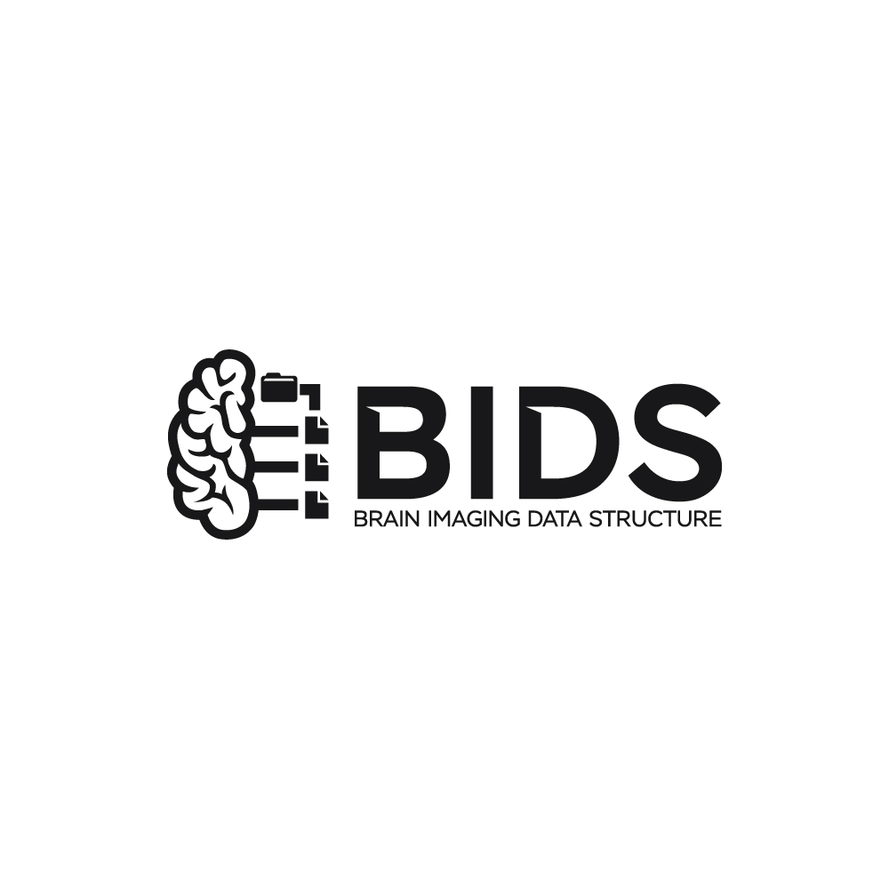
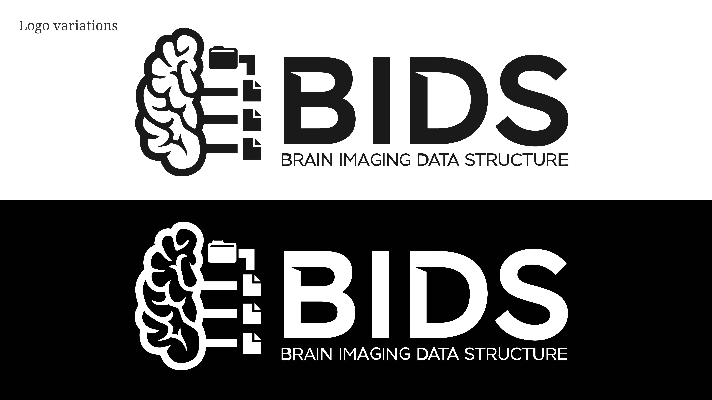
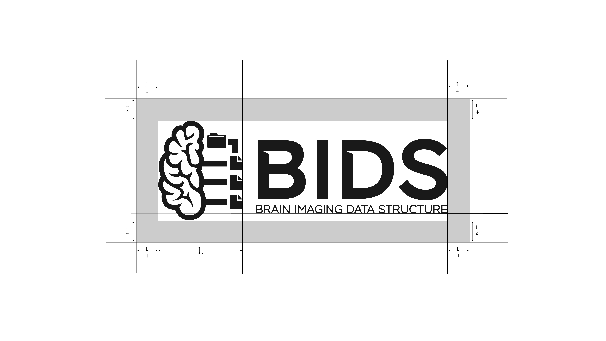
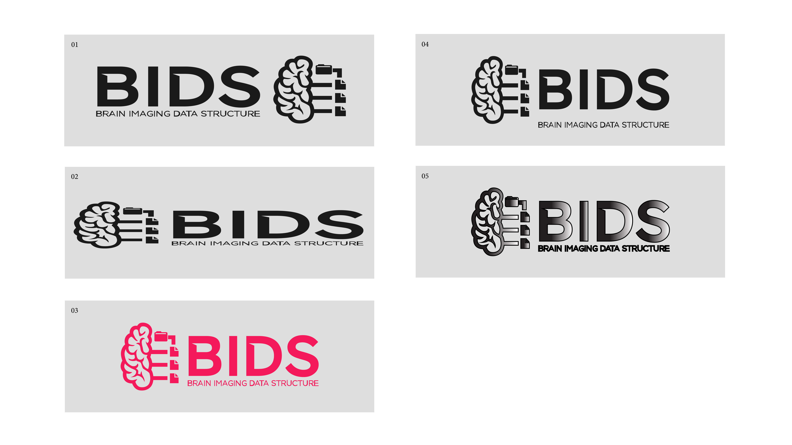
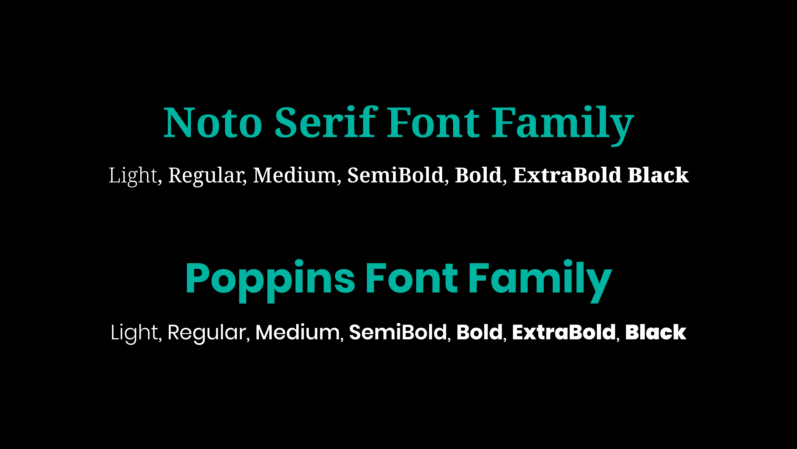

# Brain Imaging Data Structure (BIDS) Branding Design

## Table of Contents

1. [Objective](#objective)
1. [Design Process](#design-process)
1. [Brand Design and Guidelines](#brand-design-and-guidelines)
1. [Logo Design](#logo-variations)
1. [Typography](#typography)
1. [Color Palette](#color-palette)

## Objective

The BIDS brand design aims to create a unique, recognizable, and user-friendly visual identity that accurately represents the organization's values, goals, and services. The brand design should communicate professionalism, innovation, and trustworthiness, reflecting BIDS' commitment to simplifying and standardizing the organization of neuroimaging and behavioral data.

Additionally, the brand design should ensure consistency in the use of all BIDS visual elements among all users, maintaining a cohesive and professional appearance across the entire BIDS community.

To achieve this, the brand design will incorporate:

-	A Distinctive Logo
-	A Cohesive Color Scheme
-	Consistent Typography
-	Pre-designed Templates for Presentation Slides, Letterhead, and Social Media posts
-	Icons and Symbols
-	Complementary Graphic Elements
-	Brand Guidelines

These components will collectively create a professional and scientific visual identity. The design will be versatile and adaptable, suitable for various marketing materials such as brochures, magazines, business cards, advertisements, social media, website design, and merchandise.

A strong and consistent brand design will enhance BIDS' recognition within the neuroscience community and effectively communicate its values and goals, fostering greater trust and engagement.

## Design Process

The design process for the BIDS brand began with reviewing several existing repositories containing artwork and graphic designs for BIDS across GitHub. These early contributions provided a foundation and highlighted the community-driven nature of BIDS' visual identity. Our primary goal was to unite these disparate pieces into a cohesive and organized brand identity that accurately reflects BIDS' role as a standard for neuroimaging data organization.

##### Initial Audit of Existing Visual Assets
We began by gathering and reviewing all existing artwork, ensuring that no valuable elements were overlooked. Several GitHub repositories housed early graphic designs, logos, and visual assets related to BIDS. These visual elements were reviewed to identify common themes and elements that aligned with BIDS' mission of simplifying neuroimaging data organization. The unification process involved selecting the most representative elements and establishing the guidelines to maintain a consistent and professional visual language across all media.

##### Consolidation and Refinement
The next step involved consolidating these various visual assets into a unified visual identity. This included defining the guidelines, selecting a consistent color palette and typography, and ensuring that all visual elements reflected the professional and scientific nature of the BIDS community. Through this process, we created a comprehensive brand guide that consolidates the best of what had already been created.

##### Logo Design Process
A key milestone in the branding process was hosting a design competition on 99designs. The competition attracted multiple creative submissions, and after a thorough review, the final logo was selected to represent BIDS.

##### Development of Comprehensive Brand Guidelines
With the logo and visual elements finalized, the focus shifted to developing a comprehensive brand guide. These guidelines outline the correct usage of the logo, color scheme, typography, and visual assets to ensure consistency across all BIDS-related materials, whether in print or digital formats.

### Brand Design and Guidelines

#### Logo Concept (Description and Symbolism)

The BIDS logo features a stylized brain outline on the left with connected elements representing data files in hierarchical order. The word "BIDS" is prominently displayed in bold, with "Brain Imaging Data Structure" in a lighter font under the prominent BIDS text.

We used the stylized brain outline because it symbolizes the brain, which is the central focus for neuroimaging datasets. The hierarchical data files connected to the outlined brain represent the goal of BIDS as a community-driven standard created to restructure and organize the way neuroimaging datasets are shared. The data files are particularly effective because they represent a hierarchical arrangement and structuring of data files, a major aim BIDS seeks to achieve. The connection of the data files to the brain conveys the idea of brain data or data files related to the brain being structured in an organized format.

This design encapsulates BIDS' mission to simplify and standardize neuroimaging and behavioral data organization, promoting ease of use and accessibility within the scientific community.   

#### Logo Variations

The logo is available in a horizontal layout and variation, provided in both black and white transparent variants. To maintain consistency, the logo does not have a vertical variation. The horizontal variation is accepted as the primary and only format for usage. Both black and white variants should be used based on the background that best suits them for optimal contrast, legibility, and clarity.

Black variant: Use the black logo on light or white backgrounds to ensure visibility and contrast.

White variant: Use the white logo on dark or colored backgrounds to maintain clarity and legibility.   

#### Logo Usage Guidelines

A clear space also known as an exclusion zone is an area of blank space that surrounds the logo. This clear space around the logo is equal to the height of the brain icon. This ensures the logo remains uncluttered and legible.   

#### Incorrect Usage Guidelines

1. **Distortion**: Do not alter the proportions of the logo elements by condensing or stretching them horizontally or vertically. Resize the logo proportionally to maintain its original proportions.

1. **Altering Typefaces**: The typeface used in the logo is essential to its design and should not be altered or replaced with another font. This ensures legibility and visual consistency.

1. **Skewing or Warping**: Do not skew, warp, or set the logo at an angle. The logo should always be displayed upright and without distortions to maintain legibility and visual impact.

1. **Applying Effects**: Avoid adding visual effects such as drop shadows, glows, or bevels to the logo. These effects can distract and compromise the logo's legibility.

1. **Rotating the Logo**: The logo should be kept in its original orientation and not rotated or displayed at an angle. Changing the orientation can compromise legibility and weaken the logo's impact.

1. **Rearranging Elements**: Do not rearrange the visual elements of the logo. Preserving the layout and composition is essential for maintaining consistency and brand recognition.

1. **Changing Scale**: Do not change the relative size of the visual elements within the logo. Altering the scale can disrupt the balance and hierarchy, making the logo less effective.

1. **Removing Elements**: Do not remove any element from the logo. Each element has a specific meaning and purpose; removing any part can compromise the brand's recognition and impact.   

#### Typography

The BIDS brand's primary typeface is Poppins. Poppins is a modern, geometric sans-serif font that conveys a clean, professional, and approachable aesthetic, well-suited for a community-driven standard focused on simplifying and organizing neuroimaging datasets.

Poppins was chosen for its clarity, readability, and modern design. Its geometric shapes and smooth curves symbolize organization, structure, and precision, aligning with BIDS’ mission of organizing neuroimaging data in a standardized manner. Poppins works well in combination with a serif font if needed for additional materials.

Typography should predominantly use black (#000000) or white (#FFFFFF), depending on the background for readability. Other colors including the accent colors from the brand color palette can be applied as long as they maintain clarity and focus.   

#### Color Palette

#### Pre-designed Templates

##### Presentation Slide Template

##### Social Media Post Design Template_

##### Complementary Digital Assets
